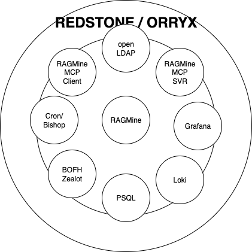

# Redstone

A modular, cloud-native application designed for flexible deployment on AWS EKS and Release.com.

## Overview

Redstone is built according to the "Built for Clarity" design philosophy, emphasizing simplicity, modularity, and maintainability. The project is structured to support multiple deployment options while providing a consistent application experience:

## Project Structure

```
├── docker-compose.yml       # Main deployment configuration for Release.com
├── .release.yaml            # Release.com specific configuration
├── .env.example             # Example environment variables
├── components/              # Application components/services
│   ├── api/                 # API service
│   ├── frontend/            # Frontend application 
│   └── worker/              # Background worker service
├── deploy/                  # Deployment configurations
│   ├── aws/                 # AWS EKS deployment resources
│   │   ├── templates/       # EKS configuration templates
│   │   ├── scripts/         # AWS deployment scripts
│   │   └── .env.example     # AWS-specific environment variables
│   └── release/             # Release.com deployment resources
│       └── api/             # Release.com API client
└── scripts/                 # Utility scripts
```

## Requirements

### For All Deployment Methods
- Docker and Docker Compose for local development
- Git for version control

### For AWS Deployment
- AWS account with appropriate permissions
- AWS CLI installed and configured
- kubectl, eksctl, and Helm installed

### For Release.com Deployment
- Release.com account for deployment

## Local Development

1. Clone this repository
2. Copy `.env.example` to `.env` and adjust variables as needed
3. Run `task setup` to initialize the environment with core services and LDAP configuration
4. Run `docker-compose up` to start all services locally
5. Access the application at http://localhost:8080

## LDAP Configuration

Redstone provides a flexible, configuration-based approach for managing LDAP users, groups, and role mappings:

### Default Configuration

The default LDAP structure is defined in `components/ldap/ldap-defaults.yaml` and includes:

- Service accounts for each component (Redmica, Grafana, Loki, etc.)
- Common user roles (admin, developer, viewer)
- Standard groups and permissions
- Role mappings for service integrations

### Customizing LDAP

To customize LDAP for your organization:

1. **Option 1**: Edit `components/ldap/ldap-defaults.yaml` directly
2. **Option 2**: Create a custom configuration at `custom/ldap-config.yaml`

The configuration system will automatically detect and use your custom configuration during setup.

### Configuration Format

```yaml
# Example structure (see ldap-defaults.yaml for full reference)
base_config:
  domain: yourdomain.local
  base_dn: dc=yourdomain,dc=local

users:
  - username: example_user
    display_name: Example User
    email: user@example.com
    groups: [developers, project_users]

groups:
  - name: developers
    display_name: Developers
    description: Development team access

role_mappings:
  redmica:
    admin: [administrators]
    developer: [developers]
```

The LDAP configuration is automatically applied during deployment using the scripts in `components/ldap/` and `scripts/configure-ldap.sh`.

## Deployment Options

### AWS EKS Deployment

For detailed AWS deployment instructions, refer to:
- The [AWS Deployment Wiki](https://redstone.redminecloud.net/projects/redstone/wiki/AWS_Deployment)
- Deployment scripts in `deploy/aws/`

High-level steps:
1. Set up required environment variables (see `deploy/aws/.env.example`)
2. Run infrastructure deployment: `./deploy/aws/scripts/infra-deploy.sh`
3. Deploy application components: `./deploy/aws/scripts/app-deploy.sh`
4. Verify deployment and configure post-deployment settings

### Release.com Deployment

This repository is also configured for easy deployment to Release.com:

1. Connect your Release.com account to this repository
2. Create a new application in Release.com using this repository
3. Configure environment-specific variables in the Release.com dashboard
4. Deploy to your desired environment

## Design Philosophy

Redstone follows the "Built for Clarity" design philosophy:

- **Simplicity Over Complexity**: Favoring clear, straightforward solutions over clever but complex ones
- **Modular Design**: Breaking the system into independent, focused components
- **Encapsulation**: Hiding internal details through well-defined interfaces
- **SOLID Principles**: Following proven design patterns for maintainability
- **Practical Heuristics**: Using KISS, DRY, and YAGNI as guiding principles
- **Continuous Refinement**: Treating design as an ongoing process

## Documentation & Resources

- [AWS Deployment Wiki](https://redstone.redminecloud.net/projects/redstone/wiki/AWS_Deployment)
- [Issue Tracker](https://redstone.redminecloud.net/projects/redstone/issues)
- [Project Standards](https://redstone.redminecloud.net/projects/redstone/wiki/Standards)

## License

MIT